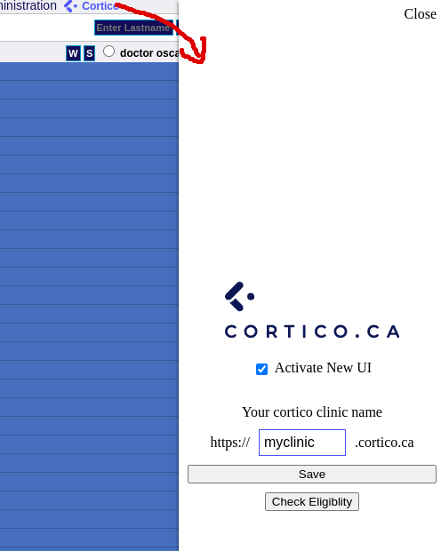
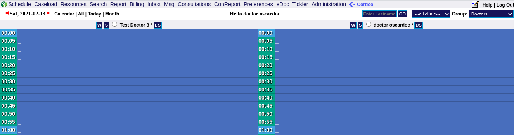

# Oscar Enhancement Suite

A suite of tools developed by [Cortico Health Technologies](https://cortico.ca) to improve the Oscar experience of Cortico users. It includes some oft-requested quality of life improvements for Oscar, unrelated to Cortico. Clinics who do not use Cortico may still use this plug-in, but support will be a best-effort basis in that case. Please log any problems in the GitHub issues.

# General Oscar Quality of Life Features:

- Drag and drop functionality on the schedule (see screenshot below)
- A quick way to check public health insurance eligibility for your whole schedule. Open the control panel for the plug-in (click "Cortico" menu item, in image below), and click "Check Eligibility".
- Prevents Oscar refreshing while you are actively working (which interrupts your work). Oscar will wait until your mouse stops moving for a minute.
- Includes a subtle user interface theme (see picture below, which can be enabled optionally in the control panel).

Drag and Drop:


Cortico Control Panel:



Custom Oscar Theme



# Cortico Specific Features (optional)

- Allows joining a video call directly from the schedule page.
- Allows you to see diagnostic questions that patients answered in the online booking system.

We hope this repository can provide a helpful testing ground for some new Oscar UI feaures and we would love to contribute them to the Oscar source code for various OSPs who may be interested! Please contact me at clark@cortico.health if you want assistance merging anything here into Oscar itself.

# Developing

Make changes in the appropriate and generate a build.

1. yarn
2. yarn build

The build output will be in `dist` directory

# Testing

The minified file located in `dist` directory named `cortico-min.js` may be loaded
into tampermonkey, or greasemonkey for direct testing before publishing.

The developers would need to ensure what they want to test went through the build process via

1. yarn
2. yarn build

**TamperMonkey**

Here's the one time tampermonkey script that auto updates to latest distribution file

    // ==UserScript==
    // @name Cortico Require Main
    // @namespace http://tampermonkey.net/
    // @version 0.1
    // @description try to take over the world!
    // @author You
    // @match https://_/_
    // @icon data:image/gif;base64,R0lGODlhAQABAAAAACH5BAEKAAEALAAAAAABAAEAAAICTAEAOw==
    // @require https://raw.githubusercontent.com/cortico-health/oscar-enhancement-suite/main/dist/cortico-min.js
    // @grant none
    // ==/UserScript==

# Debugging

There are times when you want to visit what's wrong in the minified bundle, or after it has built.
To enable source maps, in `webpack.config.js`

    "devtool": "source-map"
    "mode": "development"

1. yarn build

Then load these in to tampermonkey/greasemonkey and inspect the error. You should have sourcemaps enabled so that you know where things went wrong.

# Contributing

Remember to test your changes on all version of Osccar (OpenOSP, WELL, community edition) before publishing.

## How to package and update the Firefox extension

The official Mozilla account for this plug-in is clark@countable.ca . Please contact him to publish changes.

Notes on publishing:

Sign into addons.mozilla.org, and submit an updated version.

- you must increment the version in manifest.json

To package the add-on, do

```
zip -r cortico.zip dist icons manifest.json
```

Then, upload this on https://addons.mozilla.org/en-CA/developers/addon/

Indicate the plug-in does not use remote code (which is the case).

## How to package and update the Chrome extension

The Chrome developer account is shirley@countable.ca. Contact her to publish changes. In the Privacy tab:

Description:

```
Cortico extension for Oscar EMR quality-of-life improvements. Features include:
- "Cortico Video Call" button on the appointment page for video appointments that links to the Cortico video page.
- The "Resources" field has been turned into a dropdown, with the following options: "clinic", "video", "phone", and "other" (custom text) to allow for easier integration with Cortico's appointment types.
- Sticky headers (doctor names are fixed on top of the page while scrolling) on the doctor schedule for Juno and OpenOSP Oscar instances.
- Prevent the doctor schedule page from refreshing if you're in the middle of doing work.
```

Host permission justification:

```
This extension provides additional functionality to Cortico customers who use Oscar EMR, an open-source EMR software that is hosted by several popular providers. As such, we are unable to match on specific host or domain names. However, we have mitigated this by matching specific paths in the manifest.json, as well as in the extension (cortico.js) itself. This extension is intended to be unlisted in the Chrome store as it is not intended for the general public and we will be privately distributing it to Cortico customers.
```

Are you using remote code?

- No
